<h1 align="center">Notations</h1>

> **Before Starting**: If you have a need of notations always, keep this markdown open in a separate tab.

* 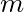 is the number of instances in the dataset you are measuring the RMSE on.
  * For example, if you have data for 2000 districts then, *m* = 2000.
* 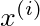 is a vector of all the feature values of the 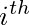 instance in the dataset and 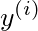 is its label.
  * For example, if the first district in dataset is located at longitude -118.29 degree, lattitude 33.91 degree, and it has 1,416 inhabitants with a median income of \$38,372, and the median house value is \$156,400 then:

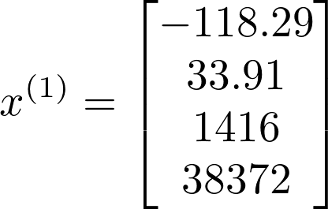

and:

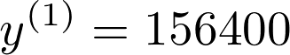

* **X** is a matrix containing all the feature values (excluding labels) of all instances in the dataset. There is one row per instance and  row is equal to transpose of , noted 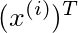
  * Example **X** matrix:

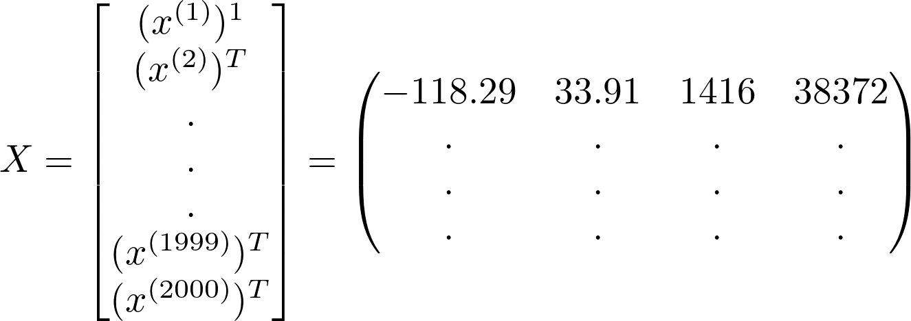

* 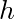 is your prediction function, a.k.a. *Hypothesis*. To predict value for instance  we use - 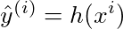.

* *RMSE*(**X**, *h*) and *MAE*(**X**, *h*) are the cost functions.
* *RMSE* corresponds to *Eucledian norm*. It is also called the 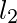 *norm*, noted 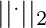 or 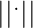.
* *MAE* corresponds to 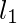 norm, noted 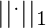. It is sometimes called *Manhatton norm* as it measure distance between two points in a city if you can only travel along orthogonal city blocks.
* k-norm of a vector **v** is given by, 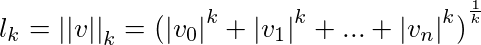. 
* Higher the value of *k* in k norm the higher the more it focuses on larger values and forget smaller ones.
