<h1 align="center">Training Models</h1>
***

* Opening the black box in this chapter.
* Having a good understanding helps you home in to the best suited model quickly.
* Will also help in debugging issues and perform error analysis.
* Will disccuss two very different ways to train it:
  * Using a direct "closed-form" equation that directly computes the model parameters that best fit the model to the training set  - minimizing the cost function in one go.
  * Using an iterative optimization approach, called Gradient Descent (GD), that gradually tweaks the model parameters to minimize the cost function over training set, eventually converging the same set of parameters as first method.

**NOTE: Open up the [TrainingModels.ipynb](./TrainingModels.ipynb) notebook in different tab as much of the code and outputs are there. This will make it easy to compare theory with implementations.**

## Linear Regression
* Linear model makes prediction by simply computing weighted sum of the inputs plus a *bias* (aka *intercept term*).

|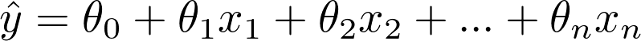|
|:---------------------------------------:|
|Equation of Linear Regression |

* This can be written in vectorized form

|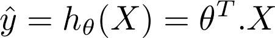|
|:---------------------------------------:|
|Vectorized equation of Linear Regression |

Here,

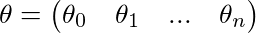

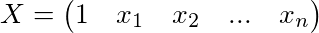

### Training Linear Regression
* Training a model means setting the parameters such that it best describes the data it is trained on while mantaining its generality.
* For this we need a measure of how poorly the model is performing - RMSE (as learnt in previous chapters).
* In practice it is easy to minimize MSE rather than RMSE and we get the same result.

|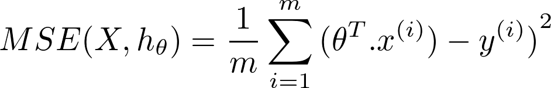|
|:---------------------------------------:|
| Mean Squared Error for Linear Regression |

### The Normal Equation
* To find the value of theta that minimizes the cost function, there is a *closed-form solution* - in other words, a mathematical equation that gives the result directly. This is called *Normal Equation*.

|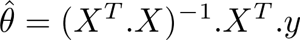|
|:---------------------------------------:|
| Normal Equation |

**See test of this equation in [TrainingModels.ipynb](./TrainingModels.ipynb)**

#### Computational Complexity
* The computational complexity of computing an inverse variate from 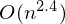 to 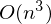 (depending on the implementation).
* We compute the inverse of 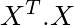 whic is *nxn* matrix with *n* being number of features.
* If we double the dataset we muliply computation roughly by 2^2.4 = 5.3 to 2^3 = 8.

***
> The normal equation gets very slow when the number of features grow large (e.g., 100,000)
***

* This equation is linear with regards to number of training instances.
* Predictions are very fast after training - the computational complexity is linear with respect to number of instances and number of features.

### Gradient Descent
* *Gradient Descent* is a very generic optimization algorithm capable of finding optimal solutions to a wide range of problem.
* Idea: Tweak parameters iteratively in order to minimize cost function.
* Gradient Descent measures the local gradient of error function with regards to the parameter vector theta, and it goes in the direction of decreasing gradient. Once the gradient is zero, you have reached a minimum.
* Concretely - we start by filling vector theta with random values (this is called *random initialization*), and then we improve it gradually, taking one baby step at a time, each step attempting to decrease the cost function, until the algorithm converges to minimum.

||
|:---------------------------------------:|
| Gradient Descent |

* The most important hyperparameter in Gradient Descent is *Learning Rate*. The Learning Rate is the step size we take towards the decreasing gradient.
* If the Learning rate is too small, it will take many steps to reach the minima. 
* If the learning rate is too high it we might jump across the minima and end up on other side, possibly even higher up than we were before.

|||
|:---------------------------------------:|:-------------------------------------------------------:|
| Gradient Descent Low Learning Rate| Gradient Descent high Learning Rate|

* Not all cost functions look nicely regular bowls. There may be holes, ridges, plateaus, and all sort of irregular terrains, making convergence to the minimum very difficult.

||
|:------------------------------------------------:|
| Gradient Descent Pitfalls |

* *MSE* for Linear Regression is a *convex function*. It is also a continuous function witha slope that never changes abruptly (its derivative is [Lipschitz continuous](https://en.wikipedia.org/wiki/Lipschitz_continuity)).
* The shape of the *MSE* cost function has a shape of a bowl. But it can be an elongated bowl if the scale of the features is very different.

|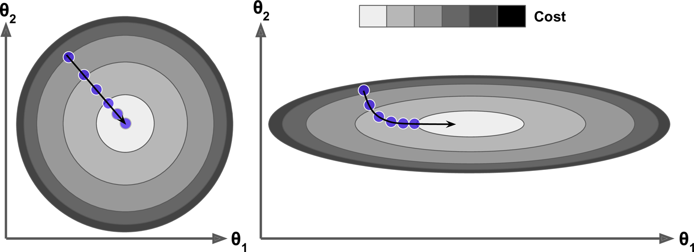|
|:------------------------------------------------:|
| Gradient Descent with and without feature scaling |

***
> When using Gradient Descent, you should ensure that all features have a similar scale or else it will take much longer to converge.
***

* The higher the dimension of *parameter space* is the difficult it is to find the optimum parameters for a given training set.

#### BATCH GRADIENT DESCENT
* For Gradient Descent we compute partial derivative w.r.t to each model parameter theta_j.

|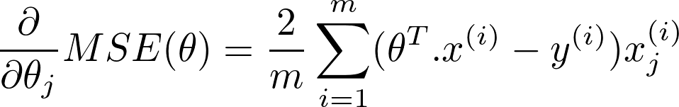|
|:---------------------------------------:|
| Partial derivative of cost function |

* We can compute partial derivative of cost function w.r.t every parameter theta using the following equation.

|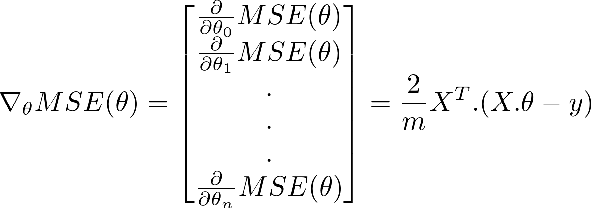|
|:---------------------------------------:|
| Gradient Vector of cost function |

***
> This method involves calculation over the full training set ***X***, at each Gradient Descent Step. This is why the algorithm is called *Batch Gradient Descent*. As a result of using complete dataset it is extremely slow with large datasets. However, it scales fast with number of features.
***

* The gradient vector points uphill while we need to move down. We can just go in opposite direction of the gradient vector. This is where the learning rate 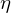 comes into play. It represenets the size of the downhill step.

|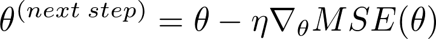|
|:---------------------------------------:|
| Gradient Descent Step |

**For detailed implementation see [TrainingModels.ipynb](./TrainingModels.ipynb)**

**For detailed comparison of different learning rate and why it matters see [TrainingModels.ipynb](./TrainingModels.ipynb).**

How to set the number of iterations? Is there a better way to decide the stopping criteria? 
* If we train for a very less number of iterations, we will be far from the global minima after the training is done.
* If we train for a very large number of iterations, we  will be jumping all over the place and might even diverge.
* One solution is to use a large number of iterations with a tiny number 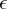 (called tolerance). Whenever the norm of the gradient vector becomes less than the tolerance we interrupt the training process.

***
> **Convergence Rate**: When the cost function and its slope does not change abruptly, it can be shown that Batch Gradient Descent with a fixed learning rate has a *convergence rate* of *O(1/iterations)*. In other words, if we divide the tolerance by 10 (to have a more precise solution), then the algorithm will have to run about 10 times more iterations.
***

#### STOCHASITC GRADIENT DESCENT
* Main problem with Batch Gradient Descent is the fact that it uses the whole training set to compute the gradients at every step. Which makes it slow when the training set is large.
* *SGD* picks a random instance in training set at every single step and compute the gradients based on only that single instance.
* Since only once instance is required in memory at a time. *SGD* is fast and can be implemented as an out-of-core algorithm.
* Due to stochastic nature, the algorithm is much less regular than Batch Gradient Descent. Instead of gently decreasing to minima the cost function bounce up down and decreases only on average. So when the algorithm stops the final params are good but not optimal.

||
|:------------------------------------------------:|
| Stochastic Gradient Descent |

* When the cost function is very irregular this can actually help the algorithm jump out of local minima, so SGD has a better chance of finding the gloabl minimum than Batch Gradient Descent.
* But this also means that the algorithm can never settle at the minimum. One solution to this is to reduce the learning rate. The steps starts out large and then get smaller and smaller, allowing the algorithm to settle for the global minimum. This process is called *simulated annealing*. The function that determines the learning rate at each iteration is called *learning schedule*.

**For detailed implementation of SGD with Learning rate scheduling see [TrainingModels.ipynb](./TrainingModels.ipynb)**.

#### MINI-BTACH GRADIENT DESCENT
* At each step, instead of computing the gradients over 1 instace or all training set, we compute gradients based on a small random sets of instances called *mini-batch*.
* Main-advantage of Mini-batch GD over SGD is that we can get performance boost from hardware optimization of matrix operations, especially using GPUs.
* It will be less erratic than SGD but can suffer from local minimas.

**For detailed implementation and comparison to the path of other algorithms see [TrainingModels.ipynb](./TrainingModels.ipynb)**.

| Algorithm      | Large m | Out-of-core support | Large n | Hyperparams | Scaling required | Scikit-Learn   |
|:--------------:|:-------:|:-------------------:|:-------:|:-----------:|:----------------:|:--------------:|
|Normal Equation | Fast    | No                  | Slow    | 0           | No               |LinearRegression|
|Batch GD        | Slow    | No                  | Fast    | 2           | Yes              |n/a             |
|Stochastic GD   | Fast    | Yes                 | Fast    | >=2         | Yes              | SGDRegressor   |
|Batch GD        | Fast    | Yes                 | Fast    | >=2         | Yes              |n/a             |
| ***Comparison of algorithms for Linear Regression*** |

***
> There is almost no difference after training: all these algorithms end up with very similar models and make predictions in exactly the same way.
***

## Polynomial Regression
* Non-linear data can be fitted to a linear model. A simple way is to add powers of each feature as new features, then train a linear model on this extended set of features. This is called *Polynomial Regression*.

**To see an example implementation of Linear Regression for Polynomial Data go to [TrainingModels.ipynb](./TrainingModels.ipynb)**

## Learning Curves
* When working with high-degree Polynomial Regression we will likely fit training data much better than Linear Regression.
* In below graph we see severe overfitting when using a 300 degree Polynomial Regressor compared to underfitting linear regressor and a comparatively good fitting quadratic regressor.

|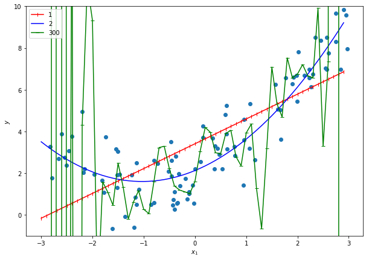|
|:------------------------------------------:|
| High Degree Polynomial Regression |

* How can we tell if the model if underfitting or overfitting?
  * One way is to use cross-validation to get an estimate of model's generalization performance. If the model performs well on training data but performs poorly on validation data, then it is overfitting. If the model performs poorly on both, then it is underfitting. This is one way to tell when a model is too simple or complex.
  * Another way is to use the *learning curves:* these are plots of model's performance on the training and validation set as a function of training set size. To see an example implementation go to [TrainingModels.ipynb](./TrainingModels.ipynb).

|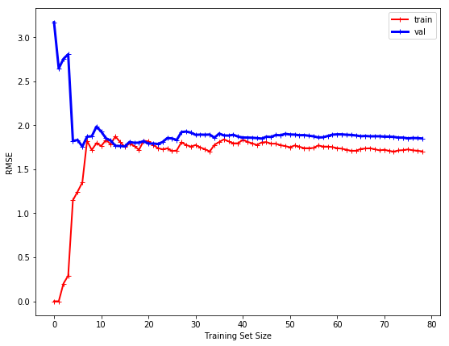|
|:------------------------------------------:|
| Learning Curves |

* Let's explain the curve.
  * Performance on training data: where there are just one or two instances in training set, the model can fit them perfectly, which is why the curve starts at zero, but as the dataset size increases it becomes impossible for model to fit the training data perfectly (because of noise in data and because the model is linear). So the error in training data goes up and reaches a plateau, at which point adding new instances doesn't make mean error much better or worse.
  * Performance on validation data: When model is trained on very few examples, it is incapable of generalizing properly, resulting in high validation error. Then a model is shown more training examples, it learns and thus validation error goes down. However, a linear model cannot perform well on modeling a non linear function, so the error ends up at a plateau, very close to the other curve.

* The curves shown are high enough and close to each other and are thus displaying underfitting.

***
> If the model is underfitting the training data, adding more training examples will not help. We need to use a more complex model or come up with better features.
***

Comparison with Polynomial Regression od degree 10.

|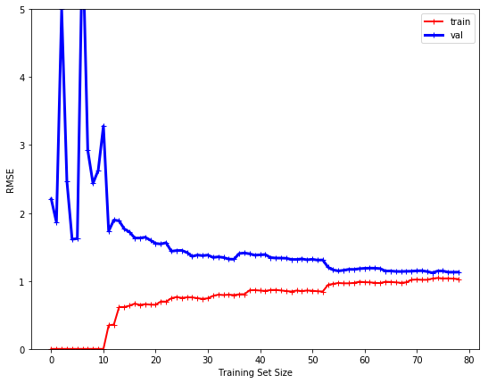|
|:------------------------------------------:|
| Learning Curves for polynomial regression|

The learning curves look a bit like the previous ones, but there are two very important differences:
* The error on training data is much lower than with LinearRegression
* There is a gap between curves. This means that the model performs significantly well on training data than on validation data. The model is overfitting. However as the training set size increase the two curves will continue to get closer.

***
> If the model is overfitting the training data, adding more training examples will reduce overfitting and can lead to very less gaps in two curves (or small difference between performance on training and validation set).
***

## Regularized Models
* To reduce overfitting of a model is to reduce the number of freedom of degrees it has.
* For a linear model we can reduce overfitting by penalizing/constraining weights.
* Three different models that implement constraints over weights:
  * Ridge Regression
  * Lasso Regression
  * Elastic Net

### Ridge Regression
* aka Tikhonov regularization
* Regularized by adding term 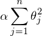 to the cost function.
* This forces algorithm not only to fit the data but also to keeps weights as small as possible.
* The regularization term should only be added during training. At time of evaluation see unregulatrized loss.

***
> Many times cost function used for training is different from performance measure used for testing. Apart from regularization, another reason for this is that a good training cost function should have optimization-friendly derivatives, while the performance measure used for testing should be as close as possible to the final objective. A good example of this is a classifier trained using a cost function such as the log loss but evaluated using precision/recall.
***

|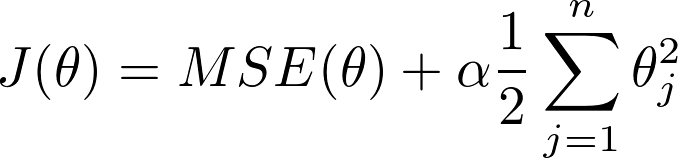|
|:------------------------------------------:|
| Ridge Regression Cost Function|

* If alpha = 0, Ridge regression becomes Linear Regression.
* If alpha is too large, the weights become zero and the line is basically flat passing through data's mean.
* We do not regularize the bias term 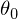
* We essentially add l2 norm of the weights to the cost function

***
> It is essential to perform data scaling before performing Ridge Regression, as it is sensitive to scale of data.
***

|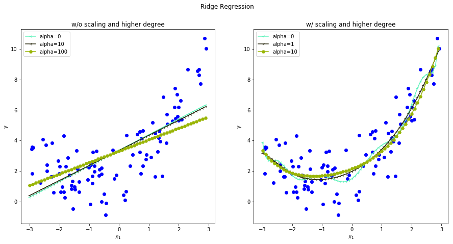|
|:------------------------------------------:|
| Ridge Regression With and Without higher degree of freedom and Scaling |

### Lasso Regression
* *Least Absolute Shrinkage and Selection Operator* Regression (simply called Lasso Regression)
* It computes l1 norm of the weights

|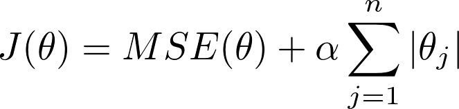|
|:------------------------------------------:|
| Lasso Regression Cost Function|

* An important characteristic of Lasso Regression is that it tends to completely eliminate the weights of the least important features (i.e., set them to zero).

|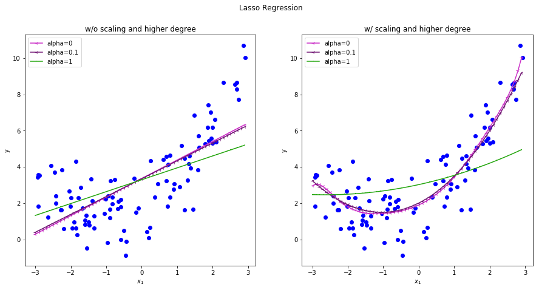|
|:------------------------------------------:|
| Lasso Regression With and Without higher degree of freedom and Scaling |

* As Regularization constant alpha increases the curve starts to become more and more linear. Displaying the elimination of weights for some features. So, it itself performs feature selection and outputs a sparse model.
* Lasso cost function is not differentiable at theta = 0, but works fine if we use a subgradient vector **g** which keeps 0 gradient at theta = 0.

|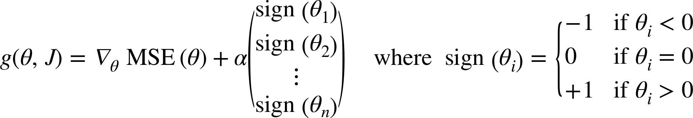|
|:------------------------------------------:|
| Lasso Regression SubGradient Function|

### Elastic Net
* Middle ground between Ridge Regression and Lasso Regression. Mixing the regularization terms in ratio.

||
|:------------------------------------------:|
| Elastic Net Cost Function|

* When r = 0, Elastic net is basically Ridge Regression. And when r = 1, it is Lasso Regression.
* **In general, Elastic Net is preferred over Lasso since Lasso may behave erratically when the number of features is greater than the number of training instances or when several features are strongly correlated.**

***
> **When to use which?**
> 1. It is preferable to have atleast a little bit of regularization. So don't go with Linear Regression directly, first try Ridge Regression.
> 2. If you suspect that only few features are useful, then use Lasso Regression or Elastic Net as they are good at feature selection to some degree.
***

### Early Stopping
* A very different approach to regularizing models.
* Stop training as soon as the validation error reaches minimum.

## Logistic Regression
* Classification Algorithm
* Used to predict probability that an instance belongs to a particular class.
* If the probability is more than 50% than the instance belongs to that class (aka positive class), else the instance belongs to the other class (aka negative class).
* It is a binary classifier.

### Estimating Probabilities
* Just like Linear Regression, Logistic Regression, computes weighted sum of the input features. But instead of outputing the result, it outputs the *logistics *of the result.
* Logistic, aka logit, is the sigmoidal function applied over the weighted sum.

||Logistic Regression probabilities|
|:------------------------------------------|:----------------------|
||**Sigmoid Function**|

||
|:------------------------------------------:|
|**Sigmoid Function Curve**|

* Cost function of logistic regression - *log loss*, for a single training instance, can be defined as:

|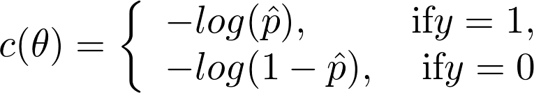|
|:------------------------------------------:|
|**Cost Function Single Instance**|

* Cost function over whole training set

|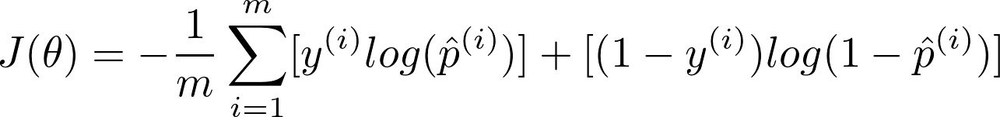|
|:------------------------------------------:|
|**Cost over whole training set**|

* There is no closed form for solution of this function. But this function is convex, so we can use Gradient descent over this.

|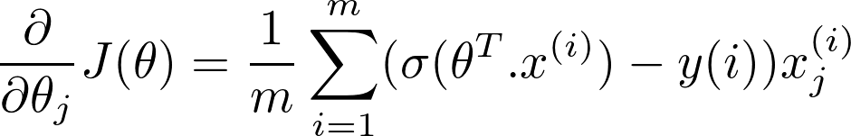|
|:------------------------------------------:|
|Partial derivative of theta|

### Decision Boundary
* Let's see estimated probability and decision boundary for [iris dataset](https://archive.ics.uci.edu/ml/datasets/iris)

|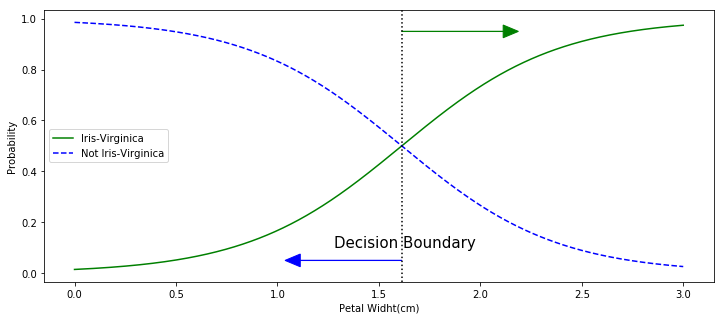|
|:------------------------------------------:|
|Estimated probabilities and decision boundary|

**See [notebook](./TrainingModels.ipynb) for implementation as well as logistic regression applied to two features not just one.**

***
>The hyperparameter controlling the regularization strength of a Scikit-Learn LogisticRegression model is not alpha (as in other linear models), but its inverse: C. The higher the value of C, the less the model is regularized.
***

## Softmax Regression
* Generalizing Logistic Regression to multiple classes, without having to train multiple binary classifier.
* This is called **Softmax Regression**, or **Multinomial Logistic Regression**.
* When given an instance x, the Softmax Regression model first computes a score sk(x) for each class k, then estimates the probability of each class by applying the softmax function (also called the normalized exponential) to the scores.
* The equation to compute sk(x) should look familiar, as it is just like the equation for Linear Regression prediction.

|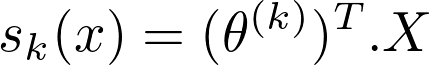|
|:------------------------------------------:|
|Softmax score for class k|

* Each class has its own dedicated parameter vector theta_k. Each parameter vector is stored in a matrix as rows.
* Probability of an instance belonging to a class:

|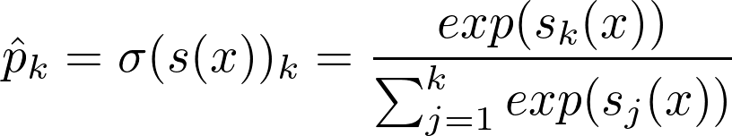|
|:------------------------------------------:|
|Softmax Function|

Here:
  * k is the number of classes
  * s(x) is a vector containing values for every class.
  * and sigma(s(x))k is estimated probability of an instance belonging to class k.

So the prediction will be argmax over the softmax operation.

***
> The Softmax Regression classifier predicts only one class at a time (i.e., it is multiclass, not multioutput) so it should be used only with mutually exclusive classes such as different types of plants. You cannot use it to recognize multiple people in one picture.
***

* Now, the goal is to minimize a cost function so that we reach the scenario of optimal paramters.

|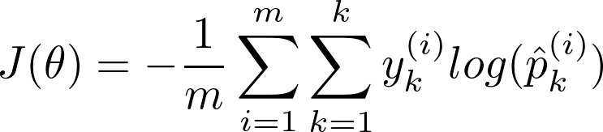|
|:------------------------------------------:|
|Cross Entropy Loss function|

* Gradient vector of this cost function:

|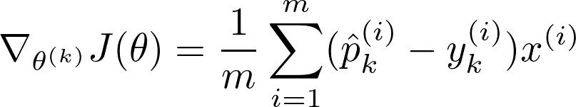|
|:------------------------------------------:|
|Cross Entropy Gradient Vector|

**For implementation of softmax regression see notebook.**
